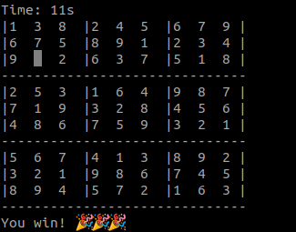

# Sudoku

Simple implementation of Sudoku in NodeJS (TypeScript).

Running in console:

## How to run this

1. Install NodeJS
2. Clone this repo
3. Run `npm install`
4. Run `npm run start` in the terminal.

## How to play

- Use ⬅️ ⬆️ ⬇️ ➡️ to move the cursor
- Use number `1-9` to fill the cell
- Use `space` to clear the cell
- Use `Ctrl + C` to exit the game

## Cheat sheet
- Use  `s` to run auto solver